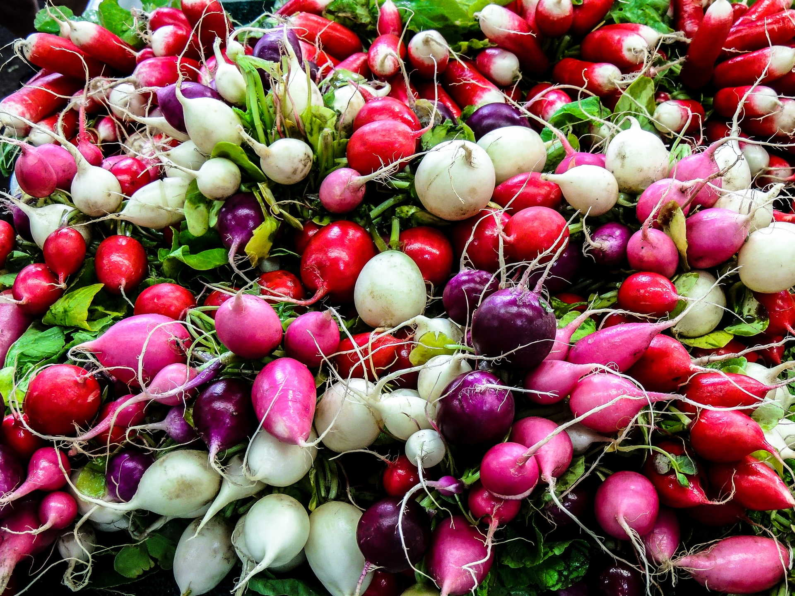

**To niepozorne warzywo to prawdziwa królowa nowalijek. Jest nie tylko pyszna, ale także, o czym mało kto wie, niezwykle zdrowa. Rzodkiewka jest prawdziwą skarbnicą witamin i minerałów. Zawiera znaczne ilości witaminy C, B1, B2 oraz beta-karotenu, a także żelazo i magnez**

## Dla czego warto jeść rzodkiewki

Zawiera znaczne ilości witaminy C, B1, B2 oraz beta-karotenu, a także żelazo i magnez. Stanowi również cenne źródło, sprzyjających zdrowiu włosów, skóry i paznokci, związków siarki oraz kwasu foliowego. Pomaga walczyć z wypadaniem włosów i pobudza ich wzrost. Pomaga wyleczyć choroby skóry, takie jak trądzik i łuszczyca. Nowalijka ma też właściwości grzybobójcze i antybakteryjne. 

Do swojego codziennego menu powinny ją włączyć osoby, cierpiące na schorzenia wątroby, ponieważ pobudza wydzielanie żółci oraz usprawnia proces trawienia. Warto po nią sięgnąć, gdy zmagamy się z dużym wysiłkiem intelektualnym bowiem, poprawia pamięć i korzystnie wpływa na procesy umysłowe.

## Jak samemu uprawiać ekologiczne rzodkiewki?

Rzodkiewki są tanie i powszechnie dostępne. Niestety zdarza się, że producenci używają do ich uprawy znacznych ilości sztucznych nawozów. Chcą w ten sposób przyspieszyć wzrost warzyw i zwiększyć ich plon. Warto więc wyhodować rzodkiewkę samemu, aby mieć pewność, że będzie zdrowa. To bardzo proste. Wystarczy słoneczny balkon i niewielka skrzynka z ziemią. W zimie możemy rzodkiewkę hodować nawet w mieszkaniu na parapecie. 

Nasiona kupimy w sklepie ogrodniczym lub kwiaciarni. Siejemy je w odległości około 2 centymetrów od siebie, a następnie przykrywamy cienką warstwą ziemi. Musimy zadbać o to, aby ziemia w skrzynce była cały czas wilgotna. Po 4-5 tygodniach doczekamy się pierwszych gotowych do zjedzenia rzodkiewek. Najlepiej je zjeść od razu po zebraniu. Mają wtedy najwięcej wartości odżywczych i są najsmaczniejsze.

## Młode liście rzodkiewek

Liście młodych rzodkiewek również są jadalne. Można udekorować nimi sałatkę lub zrobić z nich pyszne pesto do makaronu. Liście są wyraziste w smaku i również bardzo zdrowe. Oprócz całej gamy witamin zawierają chlorofil, będący bogactwem magnezu i przeciwutleniaczy. Jeżeli wybrana przez nas odmiana rzodkiewki, okaże się bardzo ostra, wcale nie musimy jeść jej na surowo. 

Warzywo to doskonale nadaje się także do duszenia, smażenia i gotowania. Na surowo jest nieodzownym składnikiem kanapek i sałatek, a na ciepło zup i zapiekanek. Warto założyć swoją własną ekologiczną hodowlę rzodkiewek i cieszyć się smakiem zebranych przez siebie warzyw.

Od siebie serdecznie mogę polecić skup warzyw[Skup warzyw](https://polmar.net/skup-warzyw)