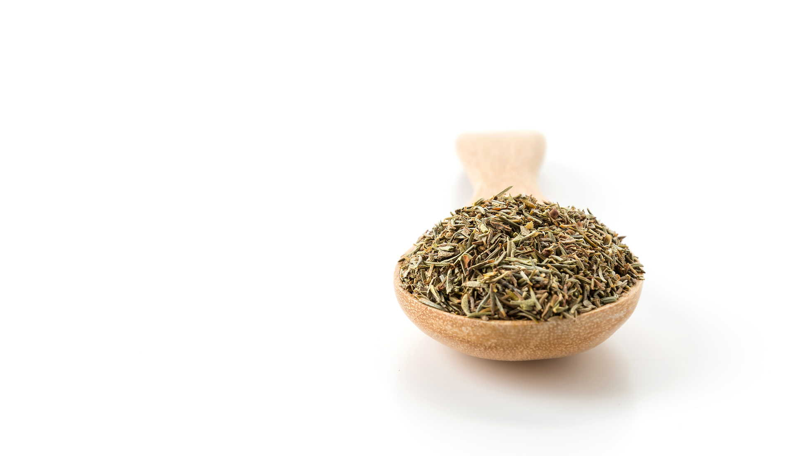

**Tymianek to aromatyczna przyprawa, po którą warto sięgać regularnie. Co warto wiedzieć na temat tej rośliny? Jakie czynniki sprawiły, że stała się ona tak ważnym składnikiem zdrowej diety?**

## Tymianek w zdrowiu i kuchni

Tymianek to wspaniała przyprawa i roślina lecznicza zarazem, którą warto docenić ze względu na znajdujące się w niej substancje oraz składniki odżywcze. Olejki eteryczne, garbniki, gorycze, sole mineralne i flawonoidy – wszystko to sprawia, iż dieta z takim dodatkiem nabiera nie tylko wyjątkowego charakteru, ale staje się cennym wsparciem dla naszego zdrowia. 

W tymianku nie brak też witamin (m. in. A, B oraz C) oraz minerałów (takich, jak potas, magnez, fosfor oraz mangan). Dzięki temu ta roślina lecznicza pomaga nam w walce z licznymi przypadłościami oraz problemami zdrowotnymi. Wiadomo, że tymianek to naturalny lek na problemy z układem oddechowym. Przeciwbakteryjne właściwości tej przyprawy sprawiają, iż staje się ona cennym wsparciem dla tych osób, którym dokuczają problemy z kaszlem oraz ból gardła. 

Tymianek pomaga również przy problemach związanych z pracą przewodu pokarmowego, może się też stać sojusznikiem tych osób, które chcą w naturalny sposób wspierać swoją wątrobę. Po tymianek warto też sięgać ze względu na skuteczność, jaką ta roślina lecznicza wykazuje się w walce ze stanami zapalnymi oraz bólami związanymi z chorobami reumatycznymi.

## Tymianek w kosmetyce?

Tymianek to również naturalny kosmetyk, dzięki któremu nasza codzienna walka o piękny wygląd stanie się łatwiejsza. Ponieważ roślina ta świetnie sprawdza się w walce z bakteriami oraz stanami zapalnymi, jest z powodzeniem wykorzystywana jako dodatek do tych zabiegów kosmetycznych, których głównym celem jest oczyszczenie skóry. 

Moc tymianku powinny docenić przede wszystkim osoby z cerą tłustą i mieszaną, dla których naturalne kosmetyki o odkażających właściwościach z pewnością staną się ważnym dodatkiem podczas pielęgnacji skóry. Z tymianku można też korzystać w trakcie pielęgnacji jamy ustnej, a pasty do zębów z takim dodatkiem mają bardzo dobry wpływ na stan dziąseł. 

Z przyprawy tej można również przygotować rewelacyjną płukankę do włosów przetłuszczających się i wykazujących skłonność do łupieżu.