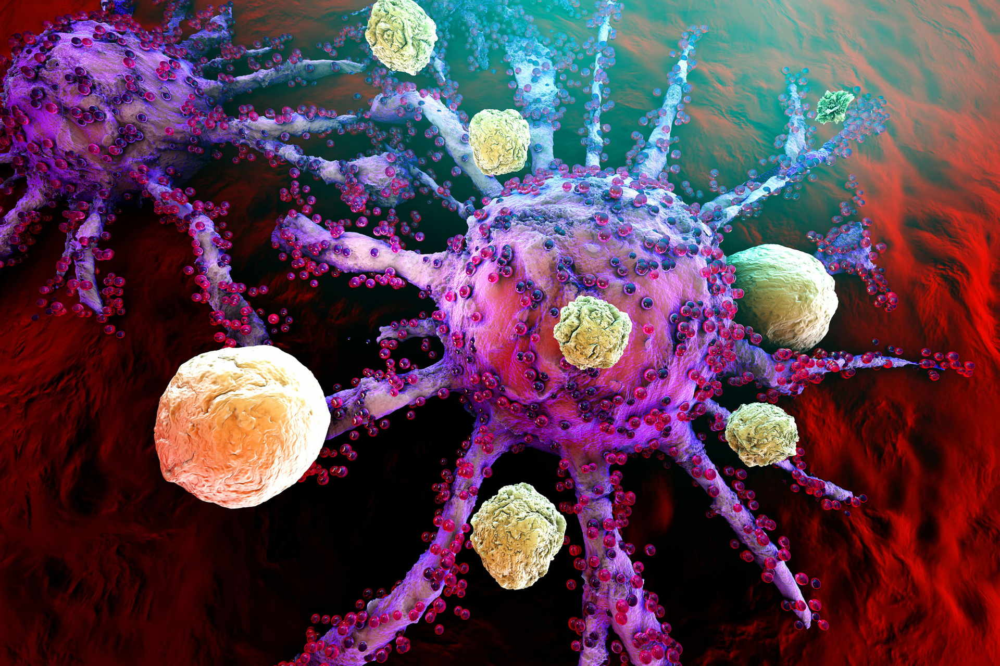

**Układ immunologiczny to niezwykły mechanizm, który zapewnia naszemu organizmowi maksymalną ochronę przed chorobami. Niestety, i ten mechanizm wymaga od nas wsparcia, dzięki czemu może skuteczniej wywiązywać się ze swych obowiązków. Co warto wiedzieć na temat układu odpornościowego?**

## Jak działa układ immunologiczny?

Układ odpornościowy to skomplikowany mechanizm obronny, składający się z wielu komórek, tkanek oraz organów. To dzięki ich sprawnej pracy jesteśmy zabezpieczeni przed wieloma infekcjami, za rozwój których odpowiadają bakterie, grzyby oraz wirusy. Im silniejsza nasza odporność, tym mniej problemów ze zdrowiem. Sprawnie działający układ immunologiczny jest wstanie w porę rozpoznać zagrożenie, a następnie – rozpocząć z nim skuteczną walkę.

## Z czego zbudowany jest nasz układ odpornościowy?

Nasz układ immunologiczny to skomplikowany twór, składający się z wielu części. Bardzo ważną rolę odgrywają tutaj węzły chłonne (limfatyczne), które mimo swych niewielkich rozmiarów mają ogromny wpływ na nasze zdrowie. Węzły chłonne, których wielkość dochodzi do jednego centymetra, rozmieszczone są w różnych częściach naszego ciała, m. in. pod pachami, w kroczu oraz na szyi. Ich powiększenie to pierwszy sygnał infekcji oraz ostrzeżenie, którego nie możemy ignorować. Gdy te niewielkie węzły zaczynają puchnąć, nasz układ immunologiczny rozpoczyna walkę z zagrożeniem.

Rozrzucone po całym ciele węzły chłonne są bardzo ważnym, lecz nie jedynym elementem wchodzącym w skład mechanizmu obronnego, w który został wyposażony nasz organizm. Węzły te są ze sobą połączone specjalnymi przewodami, czyli naczyniami limfatycznymi. Przewody te tworzą skomplikowany układ, dzięki któremu limfocyty przenoszone są do poszczególnych komórek oraz krwiobiegu. W skład układu immunologicznego wchodzą też m. in.:

* śledziona, odpowiedzialna za filtrowanie krwi i wychwytywanie niepożądanych materiałów, które się w niej znalazły;
* migdałek gardłowy, odpowiedzialny za wychwytywanie czynników niebezpiecznych dla organizmu oraz za tworzenie przeciwciał;
* naczynia krwionośne, czyli tętnice i żyły, przez które przepływa krew,
* szpik kostny, czyli tkanka, w której powstają wszystkie komórki krwi, w tym limfocyty, dzięki którym nasz organizm potrafi rozpoznać zagrożenie i w porę wytworzyć odpowiednie antyciała.

## Podsumowując

Naturalna odporność organizmu jest cennym skarbem, o który z pewnością warto zadbać. Im wcześniej to zrobimy, tym lepiej dla nas. W jaki sposób możemy go wspierać? Zdrowa dieta, pełna witamin i przeciwutleniaczy, to podstawa.